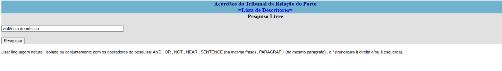
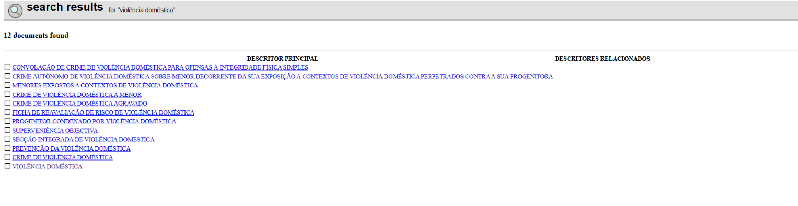
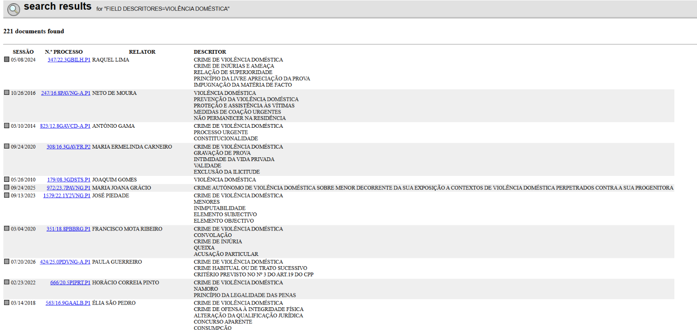
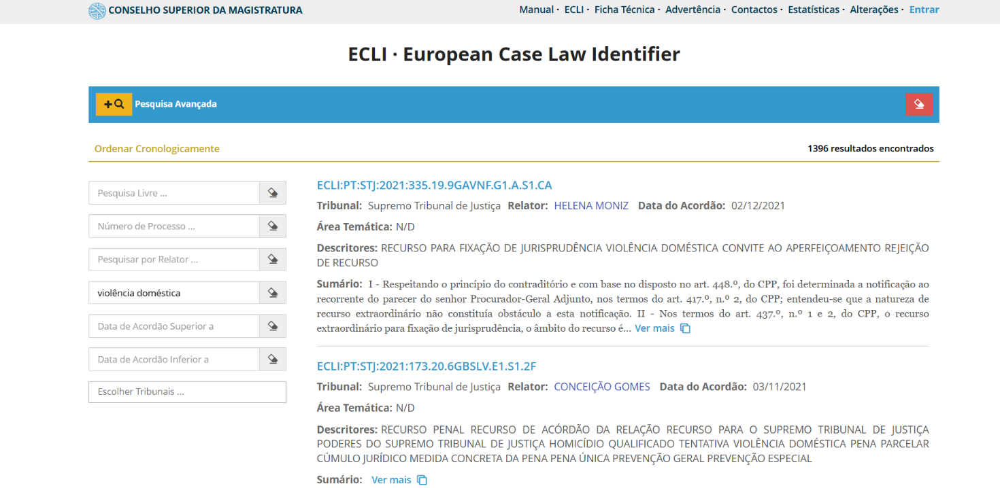

# 02 — Scraping

## Purpose
Collect raw case documents from Portuguese court databases (DGSI and CSM) into the JSON files
that [`03-data-processing.md`](03-data-processing.md) consumes. Two case types are scraped:
Domestic Violence (DV, from Courts of Appeal) and Contract Breach (BoC, from Peace Courts and
other courts).

> **Corpus snapshot warning.** The corpus used in this dissertation was scraped in **November
> 2025** and therefore contains only cases published up to that date. Re-running this scraper
> today will return a **larger and different** set of cases, because the source databases are
> continuously updated. It will **not** reproduce the exact dataset counts or evaluation figures
> reported in the thesis. To reproduce the published results, use the archived corpus from the
> Zenodo record (see [`09-reproducibility-notes.md`](09-reproducibility-notes.md)) rather than
> re-scraping.

## Prerequisites
- [01-setup.md](01-setup.md) completed.
- Google Chrome installed (the scraper drives it via Selenium).
- A network connection to dgsi.pt / jurisprudencia.csm.org.pt — this is the one stage in the
  whole pipeline that touches a live, external, government-run website. Be polite: the scraper
  waits 1 second between document requests (`asyncio.sleep(1)` in
  [`scrape_documents`](../src/scrapers/main.py)) — do not remove that delay, and avoid scraping
  at scale unnecessarily given the snapshot warning above.

## Exact commands
The scraper has two modes.

**Flag-driven** (skips the text menu and the "how many to process" prompt; a Chrome window still
opens and you still search + click the right descriptor by hand — see "What's still manual"
below):

```bash
python src/scrapers/main.py --case-type dv --court trp --limit 3
```

`--case-type` is `dv` or `boc`. `--court` is one of `TRE, TRL, TRC, TRG, TRP, STJ, JP, CSM`
(case-insensitive) — not every combination is valid; invalid combinations print the full valid
list and exit immediately, before opening a browser. `--limit` caps how many of the extracted
links actually get scraped.

**Fully interactive** (original behaviour, unchanged):

```bash
python src/scrapers/main.py
```

Follow the on-screen menu: choose a case type, choose a court, then in the Chrome window that
opens, search by keyword, click the right descriptor, and press `1` in the terminal to extract
links from the current results page (repeat across pages if there are several), then `2` to
finish.

## Walkthrough: what you actually see, and what you do

This is the part that is hard to follow from the terminal text alone, so it is worth reading
before your first run. **Neither mode is fully automatic.** When you launch the scraper, a
Chrome window opens on the source website and then *waits for you*. You search in the browser;
the scraper collects links from whatever page you leave on screen. The terminal and the browser
are used in alternation, and the script cannot advance until you act in the browser.

The flow differs between the two source databases, so both are shown below.

---

### A. DGSI (`dgsi.pt`) — Courts of Appeal and Peace Courts

Used for `--court TRP/TRE/TRL/TRC/TRG/STJ` (Domestic Violence) and `--court JP`
(Breach of Contract). The interface is dated and text-only; that is expected, not a broken page.

**Step 1 — Search.** Chrome opens on the court's *Lista de Descritores* page. Type your search
term in the **Pesquisa Livre** box **in Portuguese** — `violência doméstica` for DV, or your
contract-breach term for BoC — and click **Pesquisar**.



**Step 2 — Pick a descriptor.** You get a list of *descritores* (legal subject tags) that match
your term — not cases yet. Here `violência doméstica` returned 12. Click the descriptor that
matches what you want to collect. For the thesis corpus this was the broad, general-purpose tag
(`VIOLÊNCIA DOMÉSTICA` / `CRIME DE VIOLÊNCIA DOMÉSTICA`) rather than a narrow one like
`FICHA DE REAVALIAÇÃO DE RISCO DE VIOLÊNCIA DOMÉSTICA`, because the narrow tags return very few
cases.



**Step 3 — Land on the judgment list, then switch to the terminal.** Clicking a descriptor gives
the actual case list — here 221 documents, with columns *SESSÃO*, *N.º PROCESSO*, *RELATOR* and
*DESCRITOR*. **This is the page the scraper reads.**



Leave that page open, go back to the terminal, and press **`1`** (*Extract links from current
page*). The scraper reads the links off whatever is currently on screen and reports:

```
✅ Extracted 100 links from this page
📈 New unique links: 100
📊 Total accumulated: 100 unique links
```

**Step 4 — Repeat per page, then finish.** DGSI paginates. To collect more, **navigate to the
next results page in the browser yourself**, then press **`1`** again. Duplicates are removed
automatically, so re-extracting the same page is harmless. When you have enough, press **`2`**
(*Finish and continue with scraping*) and the scraper starts fetching the individual judgments.
Press **`3`** to quit without scraping anything.

> **If pressing `1` finds nothing**, you are almost certainly still on the search or descriptor
> page rather than the judgment list — the scraper says so and lists this as the first likely
> cause. Go back to a page that looks like the third screenshot and try again.

---

### B. CSM (`jurisprudencia.csm.org.pt`) — the ECLI database

Used for `--court CSM`. This is a modern interface and noticeably easier to work with: a
sidebar with real filters (*Pesquisa Livre*, *Número de Processo*, *Relator*, date ranges,
*Escolher Tribunais*), richer result cards showing tribunal, judge, date, descriptors and a
summary, and reliable pagination.



Search using the sidebar, then return to the terminal. Because CSM's pagination is machine-
readable, this database gets **an extra menu option that DGSI does not have**:

```
   1. Extract links from current page
   2. Finish and continue with scraping
   3. Exit without scraping
   4. 🚀 Auto-paginate through ALL CSM pages (recommended for CSM)
```

Press **`4`** and the scraper detects the total page count, walks every page and collects all
links by itself — no further clicking. **Use option `4` for CSM**; option `1` still works
page-by-page if you only want part of the results.

---

## Why the search step isn't automated
Automating the search form was a deliberate decision, not an oversight — see the docstring on
`extract_links_interactive` in [`main.py`](../src/scrapers/main.py). For a corpus collected a
handful of times for one dissertation, driving the form by hand was simpler and more reliable
than maintaining selectors against two very different court websites, one of which (DGSI) is
old enough that its markup shifts between courts.

`--case-type/--court/--limit` remove the *other* prompts (case-type menu, court menu, "how many
to scrape") so a known, repeated scrape needs less typing. They do **not** replace the human
search-and-click step described above.

## Inputs
None (reads live pages from the source websites).

## Outputs
One timestamped JSON file per run in `data/raw_data/`, e.g.
`dgsi_violencia_domestica_trp_20251013_175933.json`. Each record has the schema documented in
the class docstrings of [`domestic_violence_scraper.py`](../src/scrapers/domestic_violence_scraper.py)
and [`contract_breach_scraper.py`](../src/scrapers/contract_breach_scraper.py) — notably `url`,
`tribunal`, `n_processo`, `data_acordao`, `sumario`, `texto_integral_completo`,
`decisao_extraida_do_texto_integral`, `texto_integral_sem_decisao` (the leakage-safe text with
the decision paragraph already stripped out), and a `metadata_decisao` block describing how
confidently the decision was auto-extracted from the full text.

## Approximate runtime
Roughly 1–2 seconds per document (mostly the politeness delay), plus however long the manual
search/click step takes. A `--limit 3` run finishes scraping in well under a minute once links
are extracted.

## Expected result
```
✅ SCRAPING COMPLETE
✅ Successes: 3
❌ Failures: 0
💾 Results saved to: data/raw_data/dgsi_violencia_domestica_trp_TIMESTAMP.json
```
To reset and try again, just re-run the command — each run writes a new timestamped file and
does not overwrite previous ones. Delete the file if you don't want to keep it.
